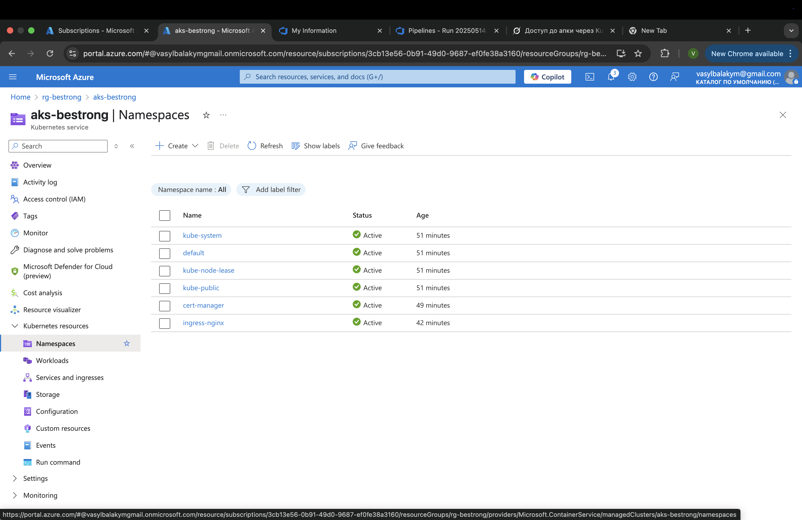

# BeStrong Blue-Green Deployment Report

## Overview
BeStrong application implements blue-green deployment strategy for seamless updates and zero-downtime deployments.

## Architecture
- Two identical environments (Blue and Green)
- Load balancer for traffic routing
- Automated deployment pipeline

## Benefits
1. Zero-downtime deployments
2. Quick rollback capability
3. Reduced deployment risk
4. Improved testing in production-like environment

## Implementation Details
- Production traffic served by active environment
- New version deployed to inactive environment
- Testing performed on inactive environment
- Traffic switched after successful validation

## Best Practices
- Maintain identical configurations
- Automated health checks
- Comprehensive monitoring
- Regular environment validation

## Conclusion
Blue-green deployment strategy enhances reliability and reduces deployment risks for the BeStrong application.

## here we can see that our aks-cluster is working and we can deploy our app

**in the field Container Registry we can see bestrong registry(ACR) to store our helm charts**

## our app is localy accessible 

## azure devops

## so, here we implement blue-green deployment and we can see some details like:

- certificates 
- services
- ingress traffic
- https connection
- accessibility

## namespaces we create

